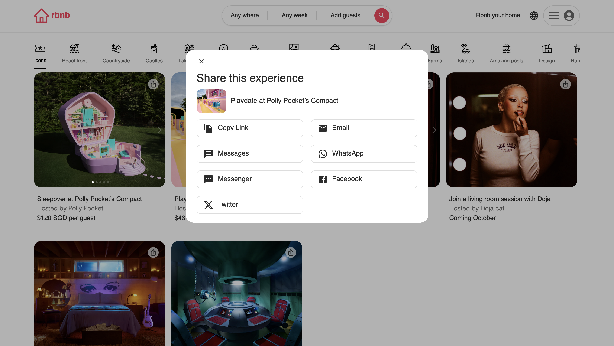
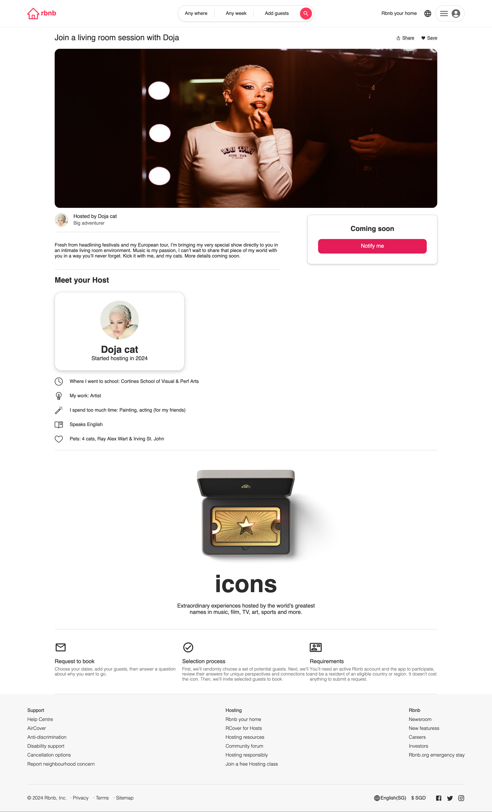

# Rbnb - A React Practice Project Inspired by Airbnb's Official Website

## Project Overview

Rbnb is a React application inspired by Airbnb's official website, designed to help users explore and book accommodations. The project leverages **React 18** and modern web technologies to deliver a responsive and interactive experience. 🌟

## Key Features

- **Routing**: Implemented with React Router, enabling smooth navigation across the application. 🗺️
- **State Management**: Managed using Redux for consistent application state. 📦
- **Home Page**: Includes sections for past experiences, a reusable Carousel component, and a Share Panel component. 🏡
- **Detail Page**: Displays detailed accommodation information and an image gallery. 🖼️
- **Data Handling**: ~~Transitioned from local JSON data to four cloud mock APIs for dynamic data retrieval.~~  
- Migrated from local JSON files to a PostgreSQL database for dynamic data management. 🌐

## Technical Stack

- **React 18**: The core library for building the user interface, utilizing the latest features for improved performance and user experience. ⚛️
- **Redux**: For managing global state and application data flow. 🔄
- **React Router**: For routing and navigation throughout the app. 🚪
- **Styled-Components**: For component-level styling with CSS-in-JS. 🎨
- **Axios**: For making HTTP requests and handling API interactions. 🌍
- **Component Libraries**: Utilizing both **Ant Design** and **MUI** (Material-UI) for a rich set of high-quality UI components. 🏗️
- **Postman**: Used for API testing, enhancing the development workflow and data simulation. 🧪
- **Craco**: For customizing the Create React App configuration. ⚙️

## Project Screenshots

### Home Page

### Share Panel

### Detail Page - V1

### Detail Page - V2

## Development Log

- **20/08/2024**: Created project and did some initial setup. 🛠️
- **21/08/2024**: Completed Header and Footer; used local `iconData.json` for testing Home Page's item display. 📄
- **22/08/2024**: Added past experiences section to Home Page; created a reusable Carousel component and Share Panel component. 🔄
- **23/08/2024**: Finished Home Page's footer; started working on Detail page and completed image display section. 🖼️
- **24/08/2024**: Completed Detail Page. ✅
- **25/08/2024**: 
  1. Tried cloud mock APIs for data retrieval and testing, replacing local JSON data. ☁️
  2. Fixed several bugs, including those caused by page navigation issues. 🐛
- **26/08/2024**: 
  1. Deployed this project to AWS Cloud using Nginx and AWS Linux. ☁️
  2. Implemented continuous integration (CI) with Jenkins to automatically monitor Git repository changes and trigger rebuilds. 🔧
- **14/09/2024**:
  Transitioned from using Apifox for API mocking to fully integrating real-time data handling via Flask and PostgreSQL for a more robust backend solution. 🌐
  

